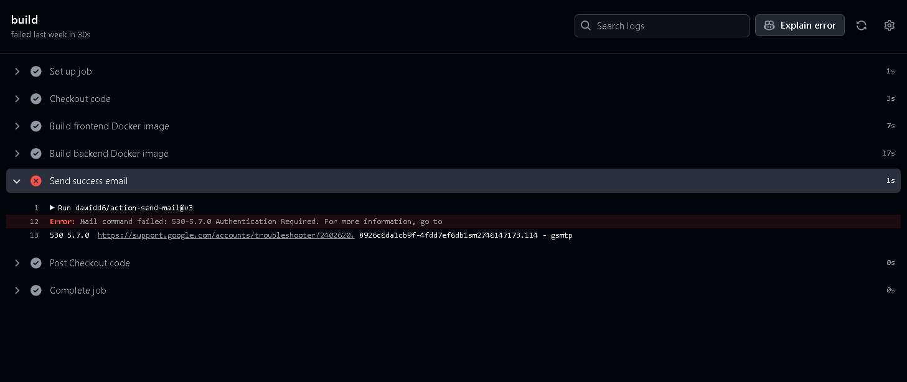

# Jeszcze poprawiam README i dema

#### Notka
Repo jest publiczne z racji, że musi być publiczne, by móc skorzystać z Railwaya

## 1 Docker ✅
3.0 obraz ubuntu z Pythonem w wersji 3.10 ✅
3.5 obraz ubuntu:24.02 z Javą w wersji 8 oraz Kotlinem ✅
4.0 do powyższego należy dodać najnowszego Gradle’a oraz paczkę JDBC 
SQLite w ramach projektu na Gradle (build.gradle) ✅
4.5 stworzyć przykład typu HelloWorld oraz uruchomienie aplikacji
przez CMD oraz gradle ✅
5.0 dodać konfigurację docker-compose ✅

📦 Kod: folder 1/

## 2 Scala ✅ 
✅ Zadanie 2 – Play Framework Scala 3 CRUD + Docker

✅ 3.0 Kontroler CRUD dla Produktów
👉 Link do commita 1
📁 Plik: app/controllers/ProductController.scala, app/models/Product.scala

✅ 3.5 Endpointy CRUD produktów działające na liście
👉 Link do commita 2
📁 Plik: conf/routes, app/controllers/ProductController.scala

✅ 4.0 Kontrolery CRUD dla Kategorii oraz Koszyka
👉 Link do commita 3
📁 Plik:

Kategorie: app/controllers/CategoryController.scala, app/models/Category.scala

Koszyk: app/controllers/CartController.scala, app/models/Cart.scala

✅ 4.5 Dockerfile + Uruchomienie aplikacji przez ngrok
👉 Link do commita 4
📁 Plik: Dockerfile

✅ 5.0 Konfiguracja CORS dla dwóch hostów
👉 Link do commita 5
📁 Plik: conf/application.conf

📦 Kod: folder 2/

## ✅ Zadanie 3 – Ktor + Discord Bot (Kotlin)

✅ 3.0 Aplikacja kliencka w Kotlinie z frameworkiem Ktor
👉 Link do commita 1
📁 Plik: src/main/kotlin/com/example/bot/App.kt

✅ 3.5 Bot nasłuchuje i odbiera wiadomości z Discorda (Kord)
👉 Link do commita 2
📁 Plik: src/main/kotlin/com/example/bot/DiscordBot.kt

✅ 4.0 Komenda !kategorie zwraca listę kategorii
👉 Link do commita 3
📁 Plik: src/main/kotlin/com/example/bot/DiscordBot.kt

✅ 4.5 Komenda !produkty <kategoria> zwraca listę produktów
👉 Link do commita 4
📁 Plik: src/main/kotlin/com/example/bot/Handlers.kt, DiscordBot.kt

❌ 5.0 Integracja z drugą platformą (Slack, Webex, Messenger)
👉 Brak 

📦 Kod: folder 3/

## ✅ Zadanie 4 – Echo + GORM (Go)

✅ 3.0 Aplikacja we frameworku Echo w Go + kontroler Produktów z CRUD
👉 Link do commita 1
📁 Plik: main.go

✅ 3.5 Model Produktów z GORM + obsługa przez kontroler
👉 Link do commita 2
📁 Plik: main.go

✅ 4.0 Model Koszyka + endpoint POST
👉 Link do commita 3
📁 Plik: main.go

✅ 4.5 Model Kategorii + relacja z Produktem
👉 Link do commita 4
📁 Plik: main.go

✅ 5.0 Scope'y GORM (filtrowanie produktów po kategorii i cenie)
👉 Link do commita 5
📁 Plik: main.go

📦 Kod: folder 4/

## ✅ Zadanie 5 – Wzorce behawioralne React + Docker

✅ 3.0 Komponenty: Produkty i Płatności + komunikacja z backendem
👉 Link do commita 1
📁 Plik: src/components/Products.tsx, src/components/Payments.tsx

✅ 3.5 Komponent Koszyk + routing React Router
👉 Link do commita 2
📁 Plik: src/components/Cart.tsx, src/App.tsx

✅ 4.0 Przekazywanie danych przez React hooks (useContext)
👉 Link do commita 3
📁 Plik: src/context.tsx, src/App.tsx

✅ 4.5 Docker + Docker Compose (frontend + backend)
👉 Link do commita 4
📁 Plik: Dockerfile, docker-compose.yml

✅ 5.0 Axios + nagłówki CORS w zapytaniach HTTP
👉 Link do commita 5
📁 Plik: src/components/Products.tsx, src/components/Payments.tsx

📦 Kod: folder 5/

## ✅ Zadanie 6 – Testy automatyczne CypressJS
✅ 3.0 20 przypadków testowych
👉 Link do commita 1
📁 Plik: cypress/e2e/todos.cy.js

✅ 3.5 Minimum 50 asercji funkcjonalnych
👉 Link do commita 2
📁 Plik: cypress/e2e/todos.cy.js

✅ 4.0 Testy jednostkowe (50+ asercji)
👉 Link do commita 3
📁 Plik: tests/unit/todoLogic.spec.js

✅ 4.5 Testy API + negatywne scenariusze
👉 Link do commita 4
📁 Plik: cypress/e2e/api/todos_api.cy.js

✅ 5.0 Uruchomienie testów na Browserstack
👉 Link do commita 5
📁 Plik: .env, package.json, browserstack:run

📦 Kod: folder 6/

## ✅ Zadanie 7 – SonarCloud: Jakość i bezpieczeństwo
✅ 3.0 Dodanie litera (SonarScan) do hooków gita (pre-push)
👉 Link do commita 1
📁 Plik: .husky/pre-push, server/sonar-project.properties

✅ 3.5 Wyeliminowanie wszystkich bugów w kodzie serwera
👉 Link do commita 2
📁 Plik: server/index.js, server/index.test.js

✅ 4.0 Wyeliminowanie wszystkich zapaszków (code smells) w serwerze
👉 Link do commita 3
📁 Plik: server/index.js

✅ 4.5 Wyeliminowanie wszystkich podatności i błędów bezpieczeństwa w serwerze
👉 Link do commita 4
📁 Plik: server/index.js, server/package.json

✅ 5.0 Wyeliminowanie wszystkich błędów i zapaszków w kliencie
👉 Link do commita 5
📁 Plik: client/src/App.js, client/src/App.test.js

📦 Kod: folder 7/project/ (client/, server/)

## ✅ Zadanie 8 – Autoryzacja i OAuth2
✅ 3.0 Logowanie przez aplikację serwerową (bez OAuth2)
👉 Link do commita 1
📁 Plik: server/index.js

✅ 3.5 Rejestracja przez aplikację serwerową (bez OAuth2)
👉 Link do commita 2
📁 Plik: server/index.js

❌ 4.0 Logowanie via Google OAuth2
❌ 4.5 Logowanie via Facebook lub Github OAuth2
❌ 5.0 Zapisywanie danych logowania OAuth2 po stronie serwera

## ✅ Zadania 9,10 – Gotowe, trzeba dodać README i dema

📦 Kod: folder 8/project/ (client/, server/)

✅ 3.0 Instancje w chmurze — Railway z Dockerfile
🌐 Platforma: Render.com
📁 Foldery: backend/ i frontend/ (osobne usługi)

✅ 3.5 Pipeline buildujący aplikację — Dockerfile + autodeploy z GitHub
📁 Plik: frontend/Dockerfile, backend/Dockerfile
ℹ️ automatycznie odpala build po git push

✅ 4.0 Notyfikacja mailowa o zbudowaniu aplikacji
📁 Plik: 10\.github\workflows\deploy.yml
ℹ️ For now commented out to avoid authentication
 

✅ 4.5 Deployment aplikacji serwerowej i klienckiej na chmurę
📁 Render automatycznie deployuje backend i frontend jako oddzielne Docker services po git push

Zadanie 10 Chmura/CI

Należy wykorzystać GitHub Actions (dopuszczalne są inne rozwiązania
CI) oraz chmurę Azure (dopuszczalne inne chmury), aby zbudować oraz
zdeployować aplikację kliencką (frontend) oraz serwerową (backend)
jako osobne dwie aplikacje. Należy do tego wykorzystać obrazy
dockerowe, a aplikacje powinny działać na kontenerach. Dopuszczalne
jest zbudowanie wcześniej aplikacji (jar package) oraz budowanie
aplikacji via Github Actions. Należy zwrócić uwagę na zasoby dostępne
na chmurze.

3.0 Należy stworzyć odpowiednie instancje po stronie chmury na
dockerze
Demo
3.5 Stworzyć odpowiedni pipeline w Github Actions do budowania
aplikacji (np. via fatjar)
Zbudowane w repo
4.0 Dodać notyfikację mailową o zbudowaniu aplikacji
4.5 Dodać krok z deploymentem aplikacji serwerowej oraz klienckiej na
chmurę
5.0 Dodać uruchomienie regresyjnych testów automatycznych
(funkcjonalnych) jako krok w Actions